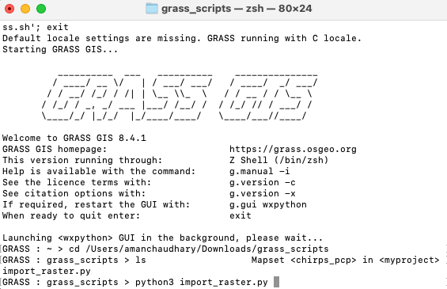

# GRASS GIS Scripting with Python

GRASS GIS can be automated and extended using Python. This page demonstrates how to write a complete geospatial analysis workflow using GRASS GIS commands in Python using `grass.script` and `pygrass`.


To execute Python scripts that use GRASS GIS modules:

1. First **launch GRASS GIS**.
2. Open the **GRASS Terminal** (comes with the GUI).
3. Run your Python script from within the GRASS session using:


---

### Python Script: Import Raster Data

This script:
- Initializes a GRASS GIS session
- Checks if the target mapset exists (creates it if not)
- Batch imports all `.tif` files from a folder

---

```bash

import os
import sys
import subprocess
import grass.script as gs
import grass.script.setup as gsetup
import re


# Main function
def main(gisdb, location, mapset): 

    os.environ['GISDBASE'] = gisdb
    os.environ['LOCATION_NAME'] = location

    # Check if mapset exists; if not, create it
    mapset_path = os.path.join(gisdb, location, mapset)
    if not os.path.exists(mapset_path):
        print(f"Mapset '{mapset}' does not exist. Creating new mapset...")
        # Create the new mapset
        gs.run_command('g.mapset', flags='c', mapset=mapset, location=location, dbase=GISDBASE)
    else:
        print(f"Mapset '{mapset}' already exists.")

    # Initialize GRASS session
    gsetup.init(gisdb, location, mapset)
    print(f"GRASS GIS session initialized in {gisdb}/{location}/{mapset}")


    input_folder = "/Users/amanchaudhary/Downloads/chirps_pcp"
    for file in os.listdir(input_folder):
        if file.endswith(".tif"):
            full_path = os.path.join(input_folder, file)
            name = re.sub(r"chirps-v3\.0\.(\d{4})", r"chirps_pcp_a_\1", os.path.splitext(file)[0])
            print(f"Importing {file} as {name}")
            gs.run_command('r.import', input=full_path, output=name,overwrite=True)


if __name__ == '__main__':
    GISDBASE = "/Users/amanchaudhary/grassdata"
    LOCATION_NAME = "myproject"
    MAPSET = "chirps_pcp"                  

    # Call the main function
    main(GISDBASE, LOCATION_NAME, MAPSET)


```


---

### Python Script: Resampling of Raster Maps

This script automates the resampling of annual CHIRPS precipitation raster maps from their native resolution (~0.05°) to approximately 300 meters (~0.0027°) using bilinear interpolation. It loops through a range of years, applies the resampling using GRASS GIS’s r.resamp.interp module, and generates new raster layers for each year.

```bash
import os
import grass.script as gs
import grass.script.setup as gsetup
import re

def main(gisdb, location, mapset):
    gsetup.init(gisdb, location, mapset)
    print(f"Initialized GRASS session in {gisdb}/{location}/{mapset}")

    # Set target resolution (~300m ≈ 0.0027 degrees)
    res = 0.0027
    gs.run_command("g.region", res=res)

    start_yr = '2020'
    end_yr = '2024'


    for year in range(int(start_yr), int(end_yr) + 1):
        input_raster = f"chirps_pcp_a_{year}"
        resampled_raster = f"chirps_pcp_resamp_a_{year}"

        # 🔀 Option 1: Resample without interpolation (nearest-neighbor, preserves values exactly)
        # Use this if you want to change resolution without modifying pixel values
        #
        # gs.run_command(
        #     'r.resample',
        #     input=input_raster,
        #     output=resampled_raster,
        #     overwrite=True
        # )

        # 🔁 Option 2: Resample using bilinear interpolation (smooths values between pixels)
        gs.run_command(
            "r.resamp.interp",
            input=input_raster,
            output=resampled_raster,
            method="bilinear",
            overwrite=True
        )

    print("✅ All rasters resampled.")

if __name__ == "__main__":
    GISDBASE = "/Users/amanchaudhary/grassdata"
    LOCATION_NAME = "myproject"
    MAPSET = "chirps_pcp"

    main(GISDBASE, LOCATION_NAME, MAPSET)


```


---


### Python Script: Export GeoTIFF's

```bash
import os
import sys
import subprocess
import grass.script as gs
import grass.script.setup as gsetup
import re


# Main function
def main(gisdb, location, mapset): 


    os.environ['GISDBASE'] = gisdb
    os.environ['LOCATION_NAME'] = location

    # Check if mapset exists; if not, create it
    mapset_path = os.path.join(gisdb, location, mapset)
    if not os.path.exists(mapset_path):
        print(f"Mapset '{mapset}' does not exist. Creating new mapset...")
        # Create the new mapset
        gs.run_command('g.mapset', flags='c', mapset=mapset, location=location, dbase=GISDBASE)
    else:
        print(f"Mapset '{mapset}' already exists.")

    # Initialize GRASS session
    gsetup.init(gisdb, location, mapset)
    print(f"GRASS GIS session initialized in {gisdb}/{location}/{mapset}")


    # Directory to export rasters
    export_dir = "/Users/amanchaudhary/Downloads/chirps_pcp_resamp"
    if not os.path.exists(export_dir):
        os.makedirs(export_dir)

    # create list of all rasters to export
    raster_names=[]
    start_yr = '2020'
    end_yr = '2024'

    for year in range(int(start_yr), int(end_yr) + 1):
        file_name = f"chirps_pcp_resamp_a_{year}"
        raster_names.append(file_name)


    # Export rasters using r.out.gdal
    for raster in raster_names:
        output_tif = f"{export_dir}/{raster}.tif"
        gs.run_command(
            'r.out.gdal',
            input=raster,
            output=output_tif,
            format='GTiff',
            createopt="COMPRESS=LZW",
            overwrite=True
        )
        print(f"Raster {raster} exported to {output_tif}")


if __name__ == '__main__':
    GISDBASE = "/Users/amanchaudhary/grassdata"
    LOCATION_NAME = "myproject"
    MAPSET = "chirps_pcp"            

    # Call the main function
    main(GISDBASE, LOCATION_NAME, MAPSET)


```


