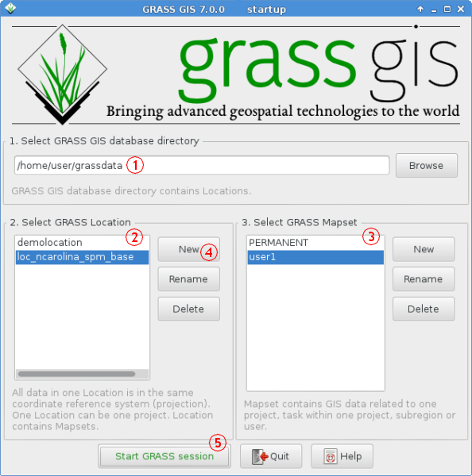
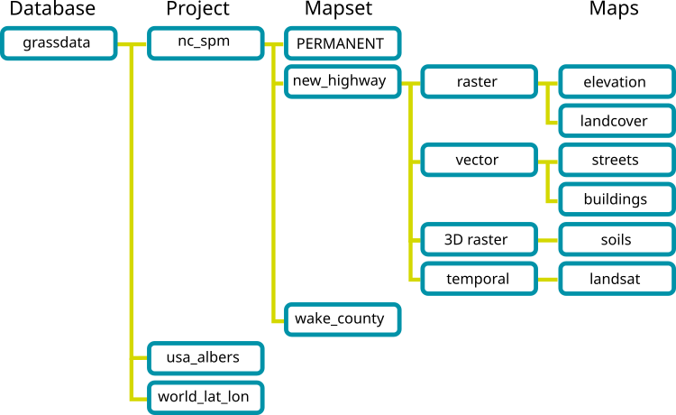
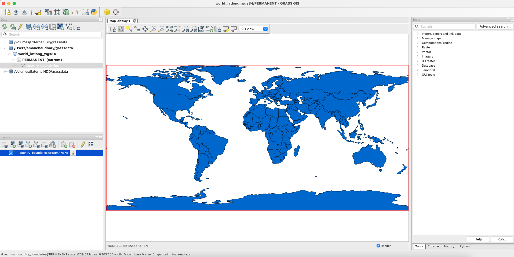
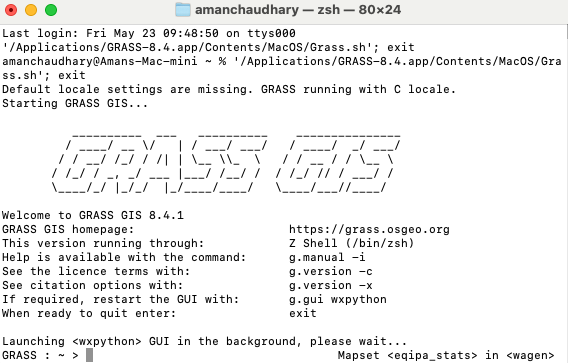

# Core Concepts
Understanding the core structure and philosophy of GRASS GIS is essential before diving into spatial analysis. GRASS GIS organizes data and operations in a unique hierarchical structure and uses powerful tools for geospatial processing.


The main component of the Data tab is the Data Catalog which shows the GRASS GIS hierarchical structure consisting of database, project and mapset .

1. **GRASS database** (root project directory):

    - **GISDBASE** is the directory where all GRASS GIS data is stored.
    - It acts as a container that holds **LOCATIONS**.
    - You can think of **GISDBASE** as the "root folder" where all GRASS-related data for a project is organized.

2. **Location (Project)** (defines projection and extent):
    - A **LOCATION** is a folder within **GISDBASE** that defines a specific coordinate system, projection, and geographic extent.
    - Each **LOCATION** is tied to a specific Coordinate Reference System (CRS), so all maps and data within a location must use the same CRS.

3. **Mapset** (stores individual data and settings):

    - A **MAPSET** is a subdirectory inside a **LOCATION** where data is stored. It helps manage different workflows or user data independently, even within the same **LOCATION**.
    - The **PERMANENT** mapset inside each **LOCATION** contains base information such as region settings (the extent and resolution) and the coordinate system. Other mapsets can be created for individual users or tasks within the same location.


> 📘 Read the [GRASS Quickstart Guide](https://grass.osgeo.org/grass-stable/manuals/helptext.html) to understand this setup better.

## GRASS GIS Startup Screen

When you open GRASS for the first time, a new directory is created in your home folder. This directory is called grassdata by default and stores all your GRASS projects. GRASS projects are simply folders storing your geospatial data with common coordinate reference system (CRS), ensuring consistency of your data. At the project level, data is further organized into subprojects called mapsets, which you can use to manage different subregions or analyses within a project. Each project contains a special mapset called **PERMANENT**, which is used to store source datasets for your analysis that can be easily accessed from other mapsets.



1. Selecting the GIS Database directory:
GRASS data are stored in a directory referred to as DATABASE (also called "GISDBASE"). This directory has to be created with a file manager or the mkdir command, before starting to work with GRASS. Within this DATABASE, the projects are organized by project areas stored in subdirectories called LOCATIONs.

2. Selecting the LOCATION (a project):
A LOCATION is defined by its coordinate system, map projection and geographical boundaries. The subdirectories and files defining a LOCATION are created automatically when GRASS is started the first time with a new LOCATION. It is important to understand that each projection stays in its own LOCATION.
See the "Location Wizard" [(4)] to easily create a new LOCATION from scratch from a geocoded file, by defining the parameters or by selecting the corresponding EPSG projection code.

3. Selecting the MAPSET (a subproject):
Each LOCATION can have many MAPSETs. Each MAPSET is a LOCATION's subdirectory. New MAPSET can be added at GRASS startup (see related button).

4. Location Wizard:
The "Location Wizard" let's you easily create a new LOCATION. You will be guided through a series of dialogues to browse and select predefined projections (also via EPSG code) or to define individual projections. You can also create new LOCATION easily from a georeferenced data file (e.g., SHAPE file or GeoTIFF, see below). Find below also some rules to define the default raster resolution for a new LOCATION.

5. Start GRASS:
Once you have selected an existing LOCATION/MAPSET or defined a new one, you can enter GRASS. The graphical user interface wxGUI will open and provide you with a menu system, map visualization tool, digitizer, and more.


---

## GRASS GIS Database Structure



| Component   | Description |
|-------------|-------------|
| `GISDBASE`  | Root folder where all GRASS GIS data is stored. |
| `LOCATION (PROJECT)`  | Folder inside `GISDBASE` that defines a projection/CRS. All data in a LOCATION shares the same CRS. |
| `MAPSET`    | Subdirectory of a LOCATION for storing actual data and managing workflows. |
| `PERMANENT` | Special mapset holding region settings and the default CRS. |
| `WIND`      | File in each MAPSET that holds region resolution/extent. |

---

## GRASS Region: Computational Window

Each analysis in GRASS operates within a defined **computational region**:
- It specifies the geographic **extent**, **resolution**, and **alignment**.
- You can view or set the region using the `g.region` command.

> 📌 *All raster calculations are restricted to the computational region.*

---

## Raster and Vector Data Models

GRASS supports both **raster** and **vector** formats:

- **Raster data** represent continuous surfaces like elevation or precipitation using a grid of cells.
- **Vector data** store discrete features such as roads, boundaries, or points of interest using geometries (point, line, polygon).

Common import commands:

- `r.in.gdal` – Import raster data
- `v.in.ogr` – Import vector data

---

## Command Structure and Modules

GRASS is modular: each task is handled by a **command-line module**.

### Standard Syntax:

```bash
module_name input=... output=... [other parameters]
```

### Module Prefixes:
- `r.` – Raster modules (e.g., `r.mapcalc`, `r.slope.aspect`)
- `v.` – Vector modules (e.g., `v.buffer`, `v.overlay`)
- `g.` – General tools (e.g., `g.region`, `g.list`)
- `i.` – Imagery and remote sensing
- `r3.` – 3D Raster data processing tools
- `db.` – Database operations
- `t.` – Temporal framework
- `d.` – Display and visualization tools


Example:
```bash
r.slope.aspect elevation=dem slope=slope_map aspect=aspect_map
```

> 📌 [Explore GRASS GIS Tools](https://grass.osgeo.org/grass85/manuals/full_index.html)

---

## GUI and CLI

- **GUI (Graphical User Interface)**: Beginner-friendly interface to access tools visually.

- **CLI (Command Line Interface)**: Powerful, scriptable, and preferred for advanced workflows.


Both interfaces work seamlessly and reflect the same underlying operations.

---

## Attribute Tables and Databases

Each vector map can be linked to an attribute table (usually SQLite by default). GRASS provides SQL-like functionality with `db.select`, `db.connect`, etc., to manage these databases.

## Scripting and Automation

- GRASS supports **Python scripting** using the `grass.script` and `grass.pygrass` modules.
- Batch processing is possible with **Bash**, **Makefiles**, or **Python Notebooks**.
- This enables building automated, reproducible workflows.

---
## Logging and Metadata

Every GRASS module logs processing history in the metadata:
- View history using `r.info` or `v.info`
- Helps maintain data **provenance** and **reproducibility**

---

By understanding these concepts, you are now ready to begin working with raster and vector data in GRASS GIS.

