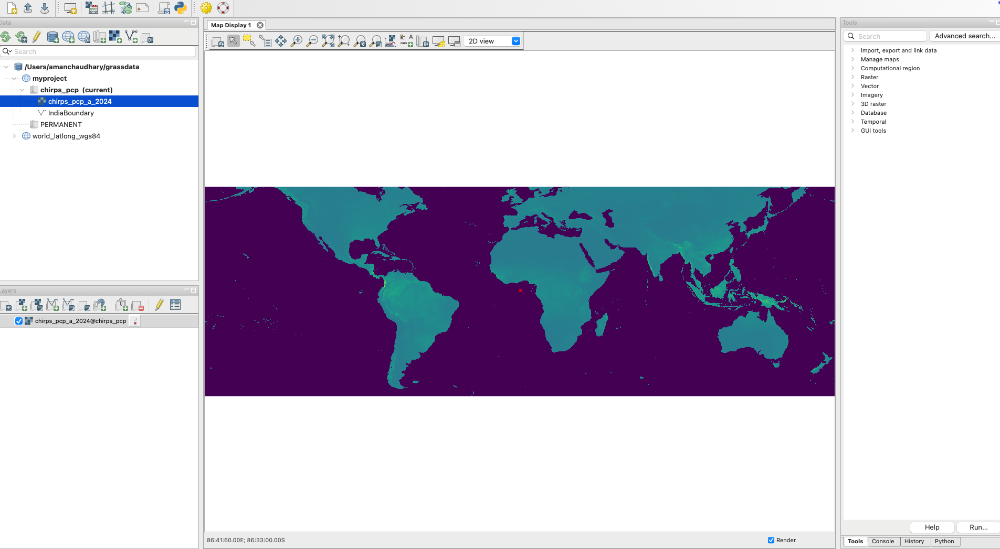
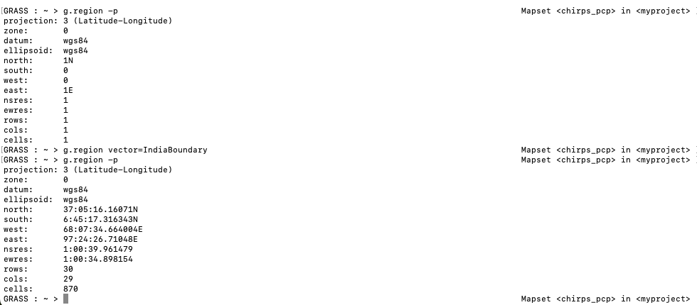
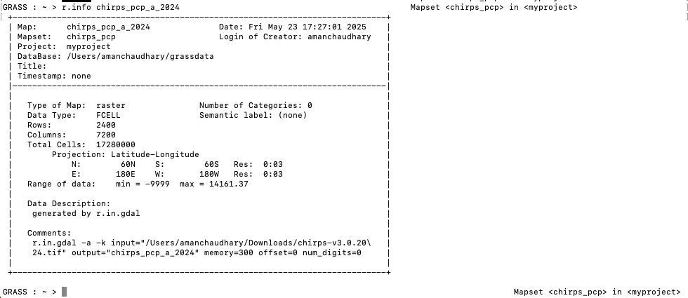
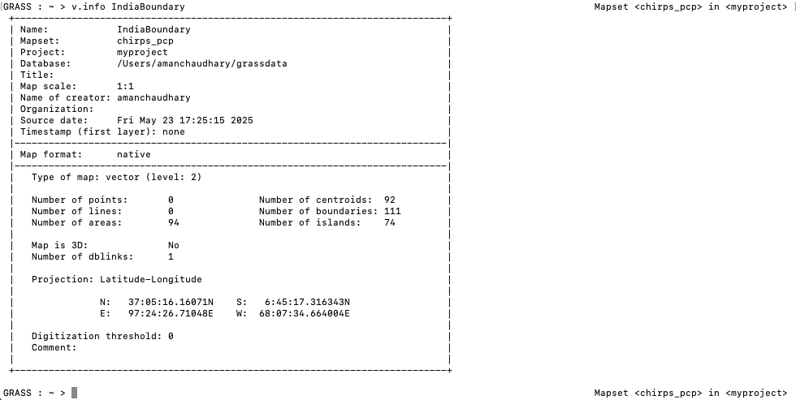

# GRASS GIS Basics

Now that you've created your **Location** and **Mapset**, you're ready to start using GRASS GIS to import data, visualize layers, and perform basic GIS operations.

This chapter covers:

- Importing raster and vector data  
- Viewing and managing layers  
- Setting the computational region  
- Accessing metadata  
- Removing/exporting data  


### 1. Import Raster Data
To bring in external raster files like `.tif`:
```bash
r.import input=/path/to/chirps-v3.0.2024.tif output=chirps_pcp_a_2024
```

Bulk Import Example:
```bash
## macOS/Linux
for file in /path/to/folder/*.tif; do
  name=$(basename "$file" .tif)
  r.import input="$file" output="$name"
done

## Windows – PowerShell
Get-ChildItem "D:\path\to\folder\*.tif" | ForEach-Object {
  $name = $_.BaseName
  r.import input=$_.FullName output=$name
}


```


### 2. Import Vector Data
To import shapefiles or other vector formats:
```bash
v.import input=/path/to/IndiaBoundary.geojson output=IndiaBoundary
```

Bulk Import Example:
```bash
## macOS/Linux
for file in /path/to/folder/*.shp; do
  name=$(basename "$file" .shp)
  v.import input="$file" output="$name"
done

## Windows – PowerShell
Get-ChildItem "D:\path\to\folder\*.shp" | ForEach-Object {
  $name = $_.BaseName
  v.import input=$_.FullName output=$name
}


```
After importing the **CHIRPS raster** and the **IndiaBoundary.geojson**, your GRASS GIS environment will be organized into a **Location**, **Mapset**, and the corresponding imported datasets.

You should see a structure similar to this in the **Data Catalog**:



### 3. Display Layers in GUI
To visualize data:
- Use Layer Manager to add raster/vector layers
- Right-click → Properties to style (color, opacity, etc.)

Or from command line:
```bash
d.rast map=my_raster
d.vect map=my_vector
```


### 4. Set the Computational Region (Optional)
GRASS GIS performs all analysis within the current region extent and resolution.
```bash
# Match region to a raster:
g.region raster=<existing_raster>
# or
g.region vector=<existing_vector>

# Set Resolution
g.region res=0.003

# To manually set region boundaries and resolution:
g.region n=25 s=10 e=90 w=70 res=0.01 -p

```

View current region settings:
```bash
g.region -p
```




### 5. List Imported Layers
```bash
g.list type=raster
g.list type=vector
```

### 6. View Layer Metadata
For raster:
```bash
r.info chirps_pcp_a_2024
```



For vector:
```bash
v.info IndiaBoundary
```



Geometry-only metadata:
```bash
r.info -g chirps_pcp_a_2024
```

